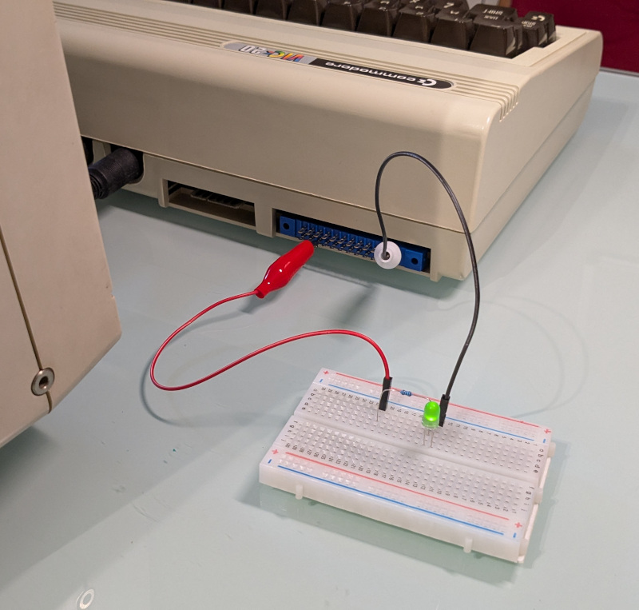

# blink65
Write Arduino-style sketches with cc65 for VIC-20, PET, and Commodore 64.



### Arduino-style API

This example summarizes the Arduino-style API implemented so far:
```
void setup(void)
{
    pinMode(LED_BUILTIN, OUTPUT);
}

void loop(void)
{
    digitalWrite(LED_BUILTIN, HIGH);
    delay(1000);
    digitalWrite(LED_BUILTIN, LOW);
    delay(1000);
}
```

### Commodore User Port

|  PIN_1  |  PIN_2  |  PIN_3  |  PIN_4  |  PIN_5  |  PIN_6  |  PIN_7  |  PIN_8  |  PIN_9  |  PIN_10 |  PIN_11 |  PIN_12 |
|:-------:|:-------:|:-------:|:-------:|:-------:|:-------:|:-------:|:-------:|:-------:|:-------:|:-------:|:-------:|
|   GND   |  _(1)_  |  _(1)_  |  _(1)_  |  _(1)_  |  _(1)_  |  _(1)_  |  _(1)_  |  _(1)_  |  _(1)_  |  _(1)_  |   GND   |
|   GND   |  _(2)_  |  I/O 0  |  I/O 1  |  I/O 2  |  I/O 3  |  I/O 4  |  I/O 5  |  I/O 6  |  I/O 7  |  _(2)_  |   GND   |
|**PIN_A**|**PIN_B**|**PIN_C**|**PIN_D**|**PIN_E**|**PIN_F**|**PIN_H**|**PIN_J**|**PIN_K**|**PIN_L**|**PIN_M**|**PIN_N**|

_(1)_ Pins of the upper row differ significantly between systems.
Some of them can be used as additional input or output lines.

_(2)_ Pins **B** and **M** of the lower row are available on all systems,
but with different constraints.

I/O pins from **C** to **L** are connected to one port of a VIA or CIA chip on all systems
and can be independently programmed as input or output.

### Acknowledgements

This project is inspired by the Arduino programming model and API.
The `setup()` / `loop()` structure and function naming follow the conventions popularized by the Arduino platform.

Arduino is an open-source project developed by the Arduino team:
https://www.arduino.cc/

This project is not affiliated with or endorsed by Arduino.

